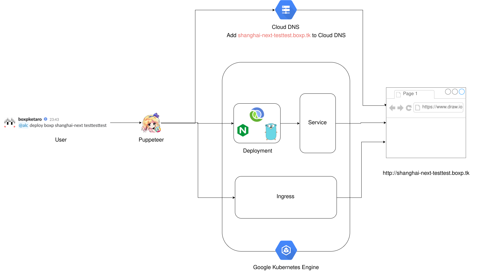

# puppeteer

A Slackbot for Deploying microservices to GKE Cluster.

## Prerequisites

- Leiningen(https://leiningen.org/)

### Optionals(For GKE Cluster)

- Google Cloud SDK(https://cloud.google.com/sdk/)
- Your GCP Account
- Your AWS Account
- Your CircleCI Account

## Usage(Local Environment)

```sh
lein run
```

## Deploy to your GKE cluster

1. Add Integration with CircleCI to your GitHub repository.
2. Add your Google Application Credentials as `$ACCT_AUTH`.
3. Apply Kubernetes/Secret to your Cluster(Examples below).

```yml
apiVersion: v1
kind: Secret
metadata:
  name: puppeteer
type: Opaque
data:
  slack-token: <echo -n "[SLACK_TOKEN]" | base64> # for slack
  github-oauth-token: <echo -n "[GITHUB_OAUTH_TOKEN]" | base64> # for github
  aws-access-key: <echo -n "[AWS_ACCESS_KEY]" | base64> # for dynamodb
  aws-secret-key: <echo -n "[AWS_SECRET_KEY]" | base64> # for dynamodb
  dynamodb-endpoint: <echo -n "http://localhost:8001" | base64> # for dynamodb
  k8s-domain: <echo -n "[YOUR_DOMAIN_NAME]" | base64>
  k8s-ingress-name: <echo -n "[YOUR_K8S_INGRESS_NAME]" | base64>
  dns-zone: <echo -n "[YOUR_CLOUD_DNS_ZONE]" | base64> # for cloud dns
```

4. Just `git push` commits.

## Usage

1. Create your mirror repository from github to Google Source Repository.
2. Add `puppet.edn` to project root folder.
3. Send mention to puppeteer `@<your-bot-name> deploy <repository-user-name> <repository-name> <branch-name>`

## License

Copyright © 2017 boxp

Distributed under the Eclipse Public License either version 1.0 or (at
your option) any later version.

## Thanks

- [旧作アリス立ち絵 表情差分](https://www.pixiv.net/member_illust.php?mode=medium&illust_id=54550636) by [dairi](https://www.pixiv.net/member.php?id=4920496)
